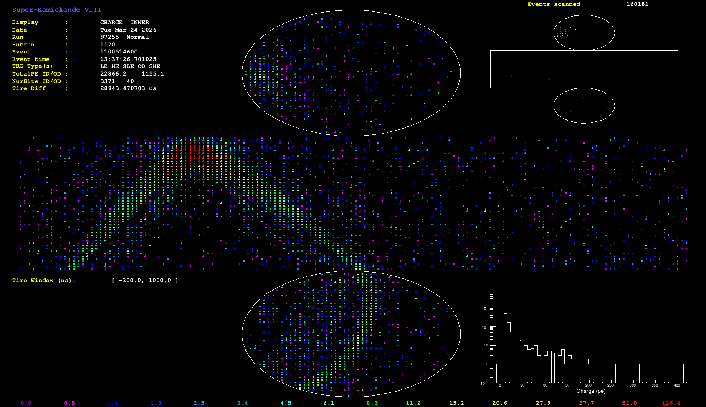

# SKLive2
Super-Kamiokande 3D Live on Raspberry Pi

<p align="center">
  
</p>

## Description
東京大学宇宙線研究所が公開している[リアルタイムデータ](https://www-sk.icrr.u-tokyo.ac.jp/realtimemonitor/)を解析し、スーパーカミオカンデ内部の PMT（光電子増倍管）配置に合わせてイベントをプロットします。
<br>Raspberry Pi & 5インチモニタ の構成で科学インテリアになります
## Features
* 10秒ごとに最新データを自動取得。
* 待機中もタッチ操作で 3D 円柱を自由に回転可能。

## Requirements
* Raspberry Pi 4 / 5
* DSI タッチモニター (5inch 480x800を使用)
* Python 3.10+
* 依存ライブラリ: `pandas`, `numpy`, `matplotlib`, `requests`, `Pillow`, `opencv-python` [一覧 libs.txt](libs.txt)

## Installation
```bash
pip install -r libs.txt  # ライブラリインストール
python sklive2.py  # 実行
```

## Technical Challenges (開発のポイント)
### 1. PMT座標の抽出
ソースとなる配信データは数値(CSV)ではなく、[平面のgif画像](https://www-sk.icrr.u-tokyo.ac.jp/realtimemonitor/skev.gif)です。画像から各PMTの色情報をピックアップします<BR>
<BR>

難点として配信されるgif画像のサイズは日によって異なり画像上のPMT(x,y)座標も固定ではありません。<br>
そのため、プログラム開始時に、```cv2.connectedComponentsWithStats()```で画像認識で座標マップを取得する工夫を入れました<br>

### 2. 座標変換と3Dマッピング
平面上のピクセルを、円柱(直径=1, 高さ=1)に合わせて再配置しました。
* 側面は、X座標を円柱の角度（θ）に変換
* 天井と底面は、z=1, z=0で直径１の円に配置
* `matplotlib`で3D plot を描画

## Acknowledge
Data source: [ICRR, The University of Tokyo](https://www-sk.icrr.u-tokyo.ac.jp/realtimemonitor/)


